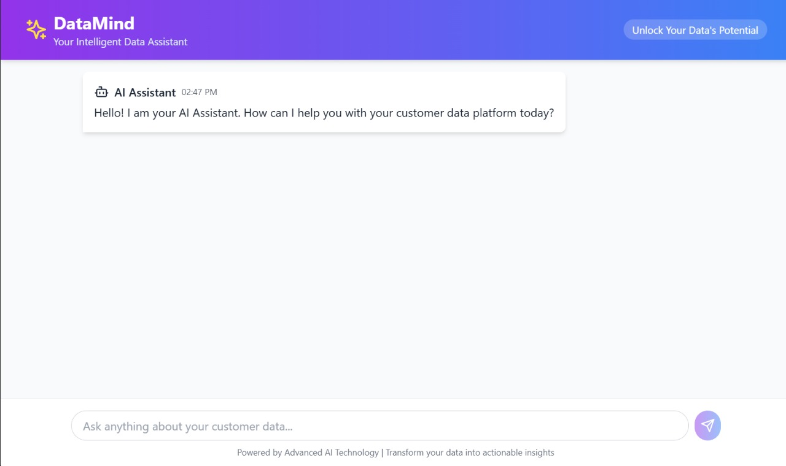

# CDP Chatbot

## Overview
CDP Chatbot is an AI-powered assistant designed to help users with customer data platform (CDP) queries. It integrates Gemini AI for NLP processing and uses PostgreSQL (NeonDB) to store documentation data.

## Features
- **NLP Processing:** Uses Gemini AI to generate intelligent responses.
- **Documentation Scraping:** Fetches and stores documentation from various CDP platforms.
- **PostgreSQL Database:** Stores documentation content for efficient retrieval.
- **React Frontend:** Provides a user-friendly chat interface.

## Tech Stack
- **Backend:** Flask, Gemini AI, PostgreSQL (NeonDB)
- **Frontend:** React.js
- **Database Schema:**
  ```sql
  CREATE TABLE cdp_docs (
      id SERIAL PRIMARY KEY,
      platform TEXT UNIQUE NOT NULL,
      content TEXT NOT NULL
  );
  ```

## Setup Instructions
1. Clone the repository:
   ```sh
   git clone https://github.com/your-repo/cdp-chatbot.git
   ```
2. Install dependencies:
   ```sh
   pip install -r requirements.txt
   ```
3. Set up PostgreSQL (NeonDB) and configure the connection.
4. Run the Flask backend:
   ```sh
   python app.py
   ```
5. Navigate to the frontend directory and start React:
   ```sh
   npm install
   npm start
   ```

## Frontend Preview


## API Endpoints
- `GET /ask?q=<query>` - Returns AI-generated answers for CDP-related queries.

## Contributing
Feel free to submit pull requests or open issues for improvements.

## License
MIT License

